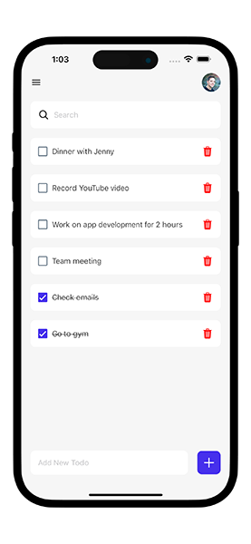

# React Native ToDo App

This is an [Expo](https://expo.dev) project created with [`create-expo-app`](https://www.npmjs.com/package/create-expo-app) to create a simple ToDo app in React Native. Here you can understand how to implement CRUD operations in react native. Also this app has local storage added to it with AsyncStorage. 

Libraries used in this project

- [Expo](https://expo.dev)
- [Expo Checkbox](https://docs.expo.dev/versions/latest/sdk/checkbox/)
- [AsyncStorage](https://docs.expo.dev/versions/latest/sdk/async-storage/)


## Get started

1. Install dependencies

   ```bash
   npm install
   ```

2. Start the app

   ```bash
    npx expo start
   ```

## App Screenshot


## Watch it on YouTube

This repository is part of a tutorial on my [YouTube channel](https://www.youtube.com/@itzpradip). Check out the complete tutorial on YouTube by clicking below. 👇

[](https://youtu.be/CfSK9niSAxY)
